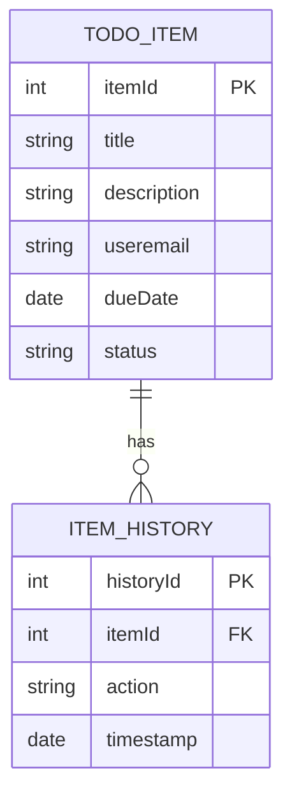

# Plan: Feature — postaviti data context i modele podataka

## Cilj
Kreirati osnovne modele podataka i postaviti data context prem diagramu

## Scope
- Dira: u folderu Context kreirati model TodoItem i ItemHistory, postaviti relaciju između njih. Kreirati dbContext i konfigurirati ga da koristi memory database.   
- Ne dira: ne dirati ništa izvan foldera Context

## Koraci
1. Kreirati model TodoItem i ItemHistory, postaviti relaciju između njih
2. Kreirati dbContext i konfigurirati ga da koristi memory database
3. Napisati unit testove za service sloj

## Definition of Done
- Modeli su kreirani i imaju ispravnu relaciju
- DbContext je kreiran i konfiguriran da koristi memory database
- Svi testovi prolaze

